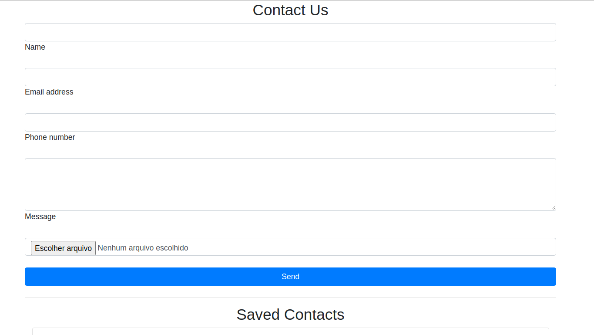

# Contact Form - React.Js, Node.Js and MySQL



## Used tecnologys

#### Frontend
- React
- BootStrap
- Axios

#### Backend
- Node.js
- Express
- Body-Parser
- Cors
- Dotenv
- Nodemailer
- MySQL
- Nodemon


## How run this project in your machine
Open your terminal and run:
```
git clone git@github.com:gabriel-am12/contact_form_react_node.git
```
Enter in the root folder of the cloned project and run:
```
npm install
```
in the **backend** and **frontend** folders. After that, use:
```
npm start
```
to run the code from backend or frontend.

